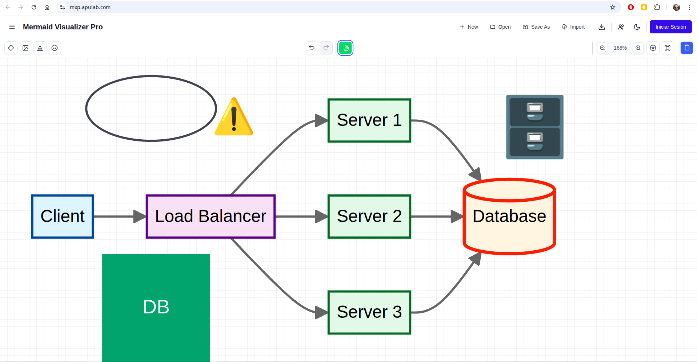
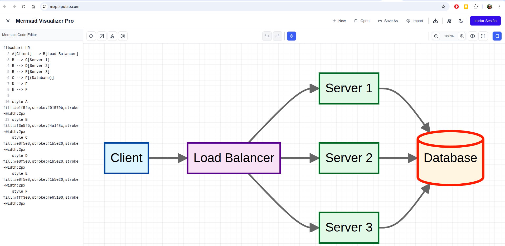
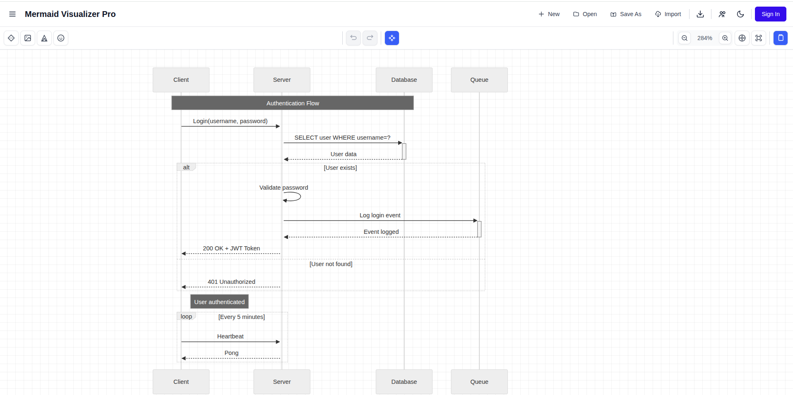

# 🎨 MermaidXP - Interactive Diagram Editor

> **🎉 PRODUCTION READY**: Professional Mermaid diagram editor with Firebase authentication and Cloudflare deployment

[](https://github.com)
[](https://reactjs.org/)
[](https://www.typescriptlang.org/)
[](https://redux-toolkit.js.org/)

## 🌐 Live Demo

**Try it now:** [https://mxp.apulab.com/](https://mxp.apulab.com/)

No installation required! Test all features directly in your browser.

## 📸 Screenshots

<div align="center">

### Interactive Canvas with Custom Elements


### Code Editor with Live Preview


### Sequence Diagrams


</div>

## 🎯 Core Features

- **📝 Code Editor**: Monaco-based Mermaid syntax editor with instant preview
- **🖱️ Interactive Canvas**:
  - **Pan Mode**: Move entire diagram from any point
  - **Drag Mode**: Move individual nodes with automatic edge updates
  - **Zoom Controls**: In/Out/Reset with smooth animations
- **🎨 Element Placement**: Add shapes, images, text, and icons directly to diagrams
- **📏 Unified Resize System**: Resize all elements with proportional scaling
- **📁 File Operations**: Open/Save `.mmd`, `.md`, `.txt` files with Firebase authentication
- **📤 Export Options**: SVG, PNG, PDF formats
- **🎨 Theme Support**: Light/Dark modes

### 🎮 Advanced Interactions

- **🔄 Drag & Drop**: Interactive node repositioning
- **🖐️ Precise Pan**: Works from any diagram element
- **📐 Smart Resize**: Proportional scaling for all element types
- **⚡ Real-time Updates**: Edges follow moved nodes automatically
- **📱 Responsive Design**: Works on desktop and mobile

### 🛠️ Developer Features

- **💾 State Management**: Redux-based architecture
- **🎯 TypeScript**: Full type safety and IntelliSense
- **⚡ Optimized Build**: Vite-powered with automatic chunking
- **🔐 Firebase Auth**: Google authentication integration

## 🚀 Quick Start

### Prerequisites

- Node.js 18+
- Modern web browser with JavaScript enabled

### Installation & Running

```bash
# Clone the repository
git clone <repository-url>
cd mermaidxp

# Install dependencies
npm install

# Start development server
npm run dev

# Open http://localhost:3000
```

### Production Build

```bash
npm run build
npm run preview
```

## 🎮 Usage Guide

### 1. Basic Editing

- Open the sidebar (📝 icon) to access the code editor
- Type or paste Mermaid syntax
- See your diagram update in real-time

### 2. Interactive Controls

- **🖱️ Pan Mode** (default): Click and drag anywhere to move the entire diagram
- **↗️ Drag Mode**: Click the arrow icon, then drag individual nodes
- **🔍 Zoom**: Use +/- buttons or mouse wheel

### 3. Adding Elements

- **Shapes**: Click shapes icon, select shape, click on canvas
- **Images**: Click image icon, click on canvas, enter URL
- **Text**: Click text icon, click on canvas, enter text
- **Icons**: Click icon button, click on canvas, enter emoji/unicode

### 4. Resizing Elements

- Select any element (text, icon, image, or SVG shape)
- Drag resize handles that appear around the element
- Proportional scaling maintains aspect ratios automatically

### 5. File Operations

- **Open**: Click folder icon, select `.mmd`/`.md`/`.txt` file
- **Save**: Requires Firebase authentication (Google Sign In)
- **Export**: Choose SVG, PNG, or PDF from export menu

## 🏗️ Project Structure

```
src/
├── components/
│   ├── canvas/          # Canvas and diagram components
│   ├── layout/          # Header, sidebar, main layout
│   └── common/          # Reusable UI components
├── store/               # Redux store and slices
├── state/hooks/         # Custom hooks for state management
├── services/            # External service integrations
└── types/               # TypeScript type definitions
```

## 🔧 Configuration

### Environment Variables

See [DEPLOYMENT.md](./DEPLOYMENT.md) for complete configuration guide.

```bash
# .env
VITE_FIREBASE_API_KEY=your-key
VITE_FIREBASE_AUTH_DOMAIN=your-domain.firebaseapp.com
VITE_FIREBASE_PROJECT_ID=your-project-id
# ... (see .env.example for complete list)
```

### Customization

- **Default Diagram**: Modify `DEFAULT_MERMAID_CODE` in `src/constants/`
- **Mermaid Config**: Adjust theme settings in `src/constants/diagram.constants.ts`
- **Styling**: Customize TailwindCSS classes or add custom CSS
- **Port Configuration**: Development server runs on port 3000 (configurable in `vite.config.ts`)

## 🧪 Development

### Available Scripts

```bash
npm run dev          # Development server (port 3000)
npm run build        # Production build
npm run preview      # Preview production build
npm run lint         # ESLint code checking
npm run format       # Prettier code formatting
npm test             # Run tests
npm run validate     # Pre-build validation
npm run deploy       # Deploy to Cloudflare Workers
```

### Code Quality

- **ESLint**: Configured with React and TypeScript rules
- **Prettier**: Automatic code formatting
- **TypeScript**: Strict type checking enabled

## 📚 Documentation

- 📖 **[DEPLOYMENT.md](./DEPLOYMENT.md)** - Cloudflare Workers deployment, environment variables, Firebase setup, CI/CD
- 📖 **[FIREBASE_SETUP.md](./FIREBASE_SETUP.md)** - Detailed Firebase configuration
- 📖 **[docs/ARCHITECTURE.md](./docs/ARCHITECTURE.md)** - Architecture and data flow
- 📖 **[docs/STANDARDS.md](./docs/STANDARDS.md)** - Tech stack and coding standards

## 🐛 Troubleshooting

### Common Issues

**Pan not working?**

- Ensure you're in Pan mode (🖱️ icon active)
- Try clicking directly on diagram elements
- Check browser console for errors

**Drag not working?**

- Switch to Drag mode (↗️ icon)
- Click directly on nodes, not empty space
- Verify diagram has rendered completely

**Resize not working?**

- Ensure element is selected (resize handles visible)
- Try clicking directly on the element first
- Check that element type supports resizing

**Diagram not rendering?**

- Check Mermaid syntax validity
- Look for errors in browser console
- Try refreshing the page

For more detailed troubleshooting, see [DEPLOYMENT.md](./DEPLOYMENT.md).

## 🚀 Deployment

### Cloudflare Workers (Recommended)

Quick deploy to Cloudflare's global network:

```bash
npm run deploy
```

**Benefits:**
- ✅ Free tier with excellent performance
- ✅ Global CDN (200+ locations)
- ✅ Automatic SSL/TLS
- ✅ Zero downtime deployments
- ✅ Works with Firebase Authentication

📖 **Complete Guide**: [DEPLOYMENT.md](./DEPLOYMENT.md)

**Important**: After deployment, add your Cloudflare Workers domain to Firebase Authentication → Settings → Authorized domains.

## 🤝 Contributing

1. Fork the repository
2. Create a feature branch (`git checkout -b feature/amazing-feature`)
3. Read [docs/ARCHITECTURE.md](./docs/ARCHITECTURE.md) before making changes
4. Commit your changes (`git commit -m 'Add amazing feature'`)
5. Push to the branch (`git push origin feature/amazing-feature`)
6. Open a Pull Request

### Development Guidelines

- Follow TypeScript strict mode
- Maintain test coverage above 80%
- Update documentation for architectural changes
- Test pan/drag/resize functionality after canvas modifications

## 📄 License

This project is licensed under the MIT License - see the [LICENSE](LICENSE) file for details.

## 🙏 Acknowledgments

- [Mermaid.js](https://mermaid.js.org/) - Diagram generation library
- [React](https://reactjs.org/) - UI framework
- [Redux Toolkit](https://redux-toolkit.js.org/) - State management
- [Vite](https://vitejs.dev/) - Build tool
- [TailwindCSS](https://tailwindcss.com/) - Styling framework

## 📊 Project Status

- ✅ **Fully Functional**: All core features working
- ✅ **Pan/Drag Fixed**: Precise interaction from any point
- ✅ **Resize System**: Unified proportional scaling for all elements
- ✅ **State Persistence**: Code, theme, zoom, pan saved to localStorage
- ✅ **Production Ready**: Optimized build and deployment
- ✅ **Well Documented**: Comprehensive technical docs
- 🔄 **Actively Maintained**: Regular updates and improvements

## 🚧 Known Limitations

- **Undo/Redo**: Unified history engine enabled (text coalescing + canvas zoom/pan). Custom elements persistence pending.
- **Multi-selection**: Not yet supported for batch operations
- **Advanced Shape Library**: Limited to basic shapes currently

---

**🎯 Ready to create interactive Mermaid diagrams? [Get started now!](#quick-start)**
