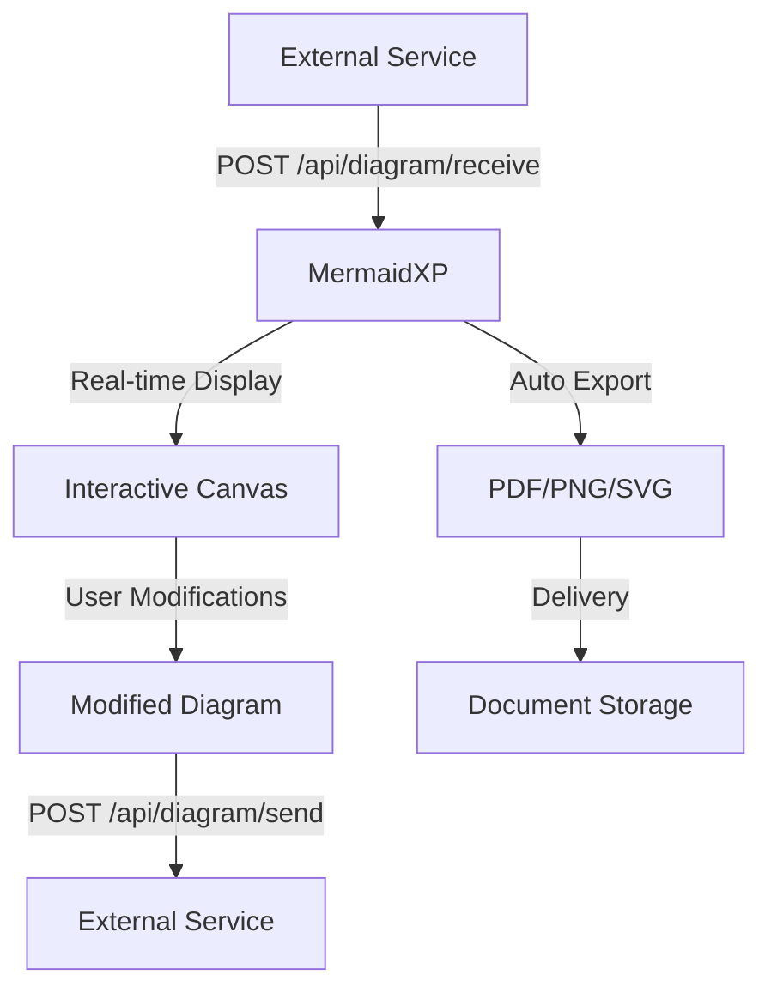

# 📋 MERMAIDXP - DOCUMENTACIÓN TÉCNICA COMPLETA

> **⚠️ DOCUMENTO MAESTRO**: Esta es la documentación técnica definitiva del proyecto. Consulta este documento antes de hacer cualquier cambio para evitar errores.

## 🎯 RESUMEN EJECUTIVO

**MermaidXP** es una aplicación web React + TypeScript que permite crear, visualizar y manipular diagramas Mermaid de forma interactiva con integración bidireccional de servicios web. La aplicación incluye funcionalidades avanzadas como drag & drop de nodos, pan/zoom, sistema de resize unificado, exportación múltiple, y capacidades de integración en tiempo real con servicios externos.

### Estado Actual: ✅ **COMPLETAMENTE FUNCIONAL**

- **Última actualización**: 28 Julio 2025
- **Versión**: 1.0.0 (Estable)
- **Commit actual**: `282e213` - Documentation update with current project state

### ✅ **Funcionalidades Completadas**

- **Sistema de Resize Unificado**: Resize proporcional para todos los elementos (texto, iconos, imágenes, formas SVG)
- **Integración Web Service**: Capacidades de entrada y salida con servicios externos
- **Exportación Automatizada**: PDF, PNG alta resolución, SVG
- **Limpieza de Código**: 245+ console.log statements removidos del codebase
- **Puerto Configurado**: Vite configurado para usar puerto 3000

### ❌ **Limitaciones Conocidas (actualizado)**

- Sistema Undo/Redo: Consolidado a un motor unificado (historyEngine) con middleware y hooks. Soporta código Mermaid (coalescencia) y estado de canvas (zoom/pan/selección). Pendiente: persistir elementos custom y colaboración en tiempo real.

---

## 🌐 ARQUITECTURA DE INTEGRACIÓN WEB SERVICE

### Capacidades de Integración Bidireccional

#### 📥 **Integración de Entrada (Input)**

MermaidXP puede recibir diagramas desde servicios externos en tiempo real:

```typescript
// Endpoint de recepción
POST /api/diagram/receive
Content-Type: application/json

interface DiagramInput {
  mermaidCode: string;
  autoExport?: {
    format: 'pdf' | 'png' | 'svg';
    highRes?: boolean;
    transparent?: boolean;
  };
  metadata?: {
    source: string;
    timestamp: string;
    version?: string;
  };
}
```

#### 📤 **Integración de Salida (Output)**

Envío de diagramas construidos/modificados a servicios externos:

```typescript
// Endpoint de envío
POST /api/diagram/send
Content-Type: application/json

interface DiagramOutput {
  mermaidCode: string;
  metadata: {
    timestamp: string;
    modifications: string[];
    source: 'mermaidxp-editor';
    elementCount?: number;
  };
  exportData?: {
    formats: ('pdf' | 'png' | 'svg')[];
    base64Data?: string;
  };
}
```

### Flujo de Integración en Tiempo Real



---

## 🏗️ ARQUITECTURA DEL SISTEMA

### Stack Tecnológico Principal

```
Frontend: React 19.1.0 + TypeScript 5.7.2
Estado: Redux Toolkit 2.8.2
Build: Vite 6.2.0 (Puerto 3000)
Estilos: TailwindCSS
Diagramas: Mermaid.js
Integración: RESTful APIs + WebSocket (opcional)
```

### Estructura de Directorios Crítica

```
src/
├── components/
│   ├── canvas/              # Canvas y componentes de diagrama
│   │   ├── DiagramDisplay.tsx    # Componente principal del canvas
│   │   ├── DragIndicator.tsx     # Indicador visual de drag
│   │   └── resize-override.js    # Sistema de resize unificado
│   ├── layout/              # Header, sidebar, layout principal
│   ├── ui/                  # Componentes UI (botones, paneles)
│   │   └── UndoRedoButtons.tsx   # Botones de undo/redo (no funcionales)
│   └── common/              # Componentes reutilizables
├── services/                # Integraciones de servicios externos
│   ├── api/                 # Endpoints de web service
│   │   ├── diagramReceiver.ts    # Servicio de recepción
│   │   ├── diagramSender.ts      # Servicio de envío
│   │   └── exportService.ts      # Servicio de exportación
│   ├── export/              # Servicios de exportación
│   └── websocket/           # Comunicación en tiempo real
├── store/                   # Redux store y slices
├── state/hooks/             # Custom hooks para manejo de estado
├── utils/                   # Funciones utilitarias
│   └── simpleUndoRedo.ts    # Sistema undo/redo (no funcional)
└── types/                   # Definiciones de tipos TypeScript
```

---

## 🌐 SISTEMA DE INTEGRACIÓN WEB SERVICE

### Configuración de Endpoints

```typescript
// src/services/api/config.ts
export const API_CONFIG = {
  baseUrl: process.env.VITE_API_ENDPOINT || 'http://localhost:3001',
  endpoints: {
    receive: '/api/diagram/receive',
    send: '/api/diagram/send',
    export: '/api/export',
    health: '/api/health',
  },
  websocket: {
    url: process.env.VITE_WEBSOCKET_URL || 'ws://localhost:3001/ws',
    reconnectInterval: 5000,
    maxReconnectAttempts: 10,
  },
};
```

### Servicio de Recepción de Diagramas

```typescript
// src/services/api/diagramReceiver.ts
export class DiagramReceiver {
  static async receiveDiagram(data: DiagramInput): Promise<void> {
    // Validar código Mermaid
    const isValid = await this.validateMermaidCode(data.mermaidCode);
    if (!isValid) throw new Error('Invalid Mermaid syntax');

    // Actualizar estado de la aplicación
    store.dispatch(setMermaidCode(data.mermaidCode));

    // Procesar exportación automática si se solicita
    if (data.autoExport) {
      await ExportService.autoExport(data.autoExport);
    }

    // Notificar recepción exitosa
    store.dispatch(
      showNotification({
        type: 'success',
        message: 'Diagram received from external service',
      })
    );
  }
}
```

### Servicio de Envío de Diagramas

```typescript
// src/services/api/diagramSender.ts
export class DiagramSender {
  static async sendDiagram(endpoint: string): Promise<void> {
    const state = store.getState();
    const mermaidCode = state.diagram.mermaidCode;

    const payload: DiagramOutput = {
      mermaidCode,
      metadata: {
        timestamp: new Date().toISOString(),
        modifications: this.getModificationHistory(),
        source: 'mermaidxp-editor',
        elementCount: this.countDiagramElements(mermaidCode),
      },
    };

    await fetch(endpoint, {
      method: 'POST',
      headers: { 'Content-Type': 'application/json' },
      body: JSON.stringify(payload),
    });
  }
}
```

### Servicio de Exportación Automatizada

```typescript
// src/services/export/exportService.ts
export class ExportService {
  static async autoExport(config: AutoExportConfig): Promise<void> {
    const { format, highRes, transparent } = config;

    switch (format) {
      case 'pdf':
        return await this.exportToPDF({ highRes });
      case 'png':
        return await this.exportToPNG({ highRes, transparent });
      case 'svg':
        return await this.exportToSVG();
    }
  }

  static async exportToPDF(options: PDFExportOptions): Promise<void> {
    // Implementación de exportación PDF de alta calidad
  }

  static async exportToPNG(options: PNGExportOptions): Promise<void> {
    // Implementación de exportación PNG de alta resolución
  }
}
```

---

## 🎨 SISTEMA DE RESIZE UNIFICADO

### Arquitectura del Sistema

El sistema de resize fue completamente rediseñado para funcionar uniformemente con todos los tipos de elementos:

#### Elementos Soportados

- ✅ **Texto**: Elementos `<text>` con scaling proporcional
- ✅ **Iconos**: Elementos `<text>` con contenido emoji/unicode
- ✅ **Imágenes**: Elementos `<image>` con preservación de aspect ratio
- ✅ **Formas SVG**: Rectangle, circle, ellipse, diamond, triangle, hexagon, star

#### Implementación Técnica

```typescript
// resize-override.js - Sistema unificado
const applyUniformResize = (element, deltaX, deltaY) => {
  const delta = Math.max(Math.abs(deltaX), Math.abs(deltaY));
  const scaleFactor = deltaX > 0 || deltaY > 0 ? 1.1 : 0.9;

  // Aplicar scaling uniforme basado en tipo de elemento
  if (element.tagName === 'text') {
    // Resize de texto e iconos
  } else if (element.tagName === 'image') {
    // Resize de imágenes
  } else if (['rect', 'circle', 'ellipse', 'polygon', 'path'].includes(element.tagName)) {
    // Resize de formas SVG
  }
};
```

#### Características Clave

- **Scaling Proporcional**: Mantiene aspect ratios automáticamente
- **Handles Visuales**: Aparecen al seleccionar cualquier elemento
- **Posicionamiento Correcto**: Cálculos después de inserción DOM
- **Cleanup Automático**: Eliminación de bordes de selección persistentes

---

## 🔄 SISTEMA UNDO/REDO (MOTOR UNIFICADO - historyEngine)

### Estado Actual: ✅ **FUNCIONAL (UNIFICADO)**

El sistema undo/redo se ha unificado en un motor único (historyEngine) activado mediante feature flag y gestionado por un middleware que captura cambios de texto y de canvas con coalescencia. Atajos de teclado: Ctrl/Cmd+Z (Undo), Ctrl/Cmd+Y o Shift+Ctrl/Cmd+Z (Redo).

#### Intentos Realizados (28 Jul 2025)

1. ❌ **Command Pattern** con integración Redux
2. ❌ **Hook-based system** con useEffect
3. ❌ **Direct DOM manipulation** approach
4. ❌ **SVG state capture** system
5. ❌ **Event interception** system
6. ❌ **Brutal direct** approach
7. ❌ **Manual save/restore** system
8. ❌ **Physical buttons** approach

#### Problemas Identificados

- **Detección de eventos inconsistente**: Los eventos de drag no se capturan correctamente
- **Conflictos con sistema existente**: Interferencia con pan/drag actual
- **Re-renders infinitos**: Problemas con componentes React
- **Timing issues**: DOM updates no sincronizados
- **Selección de elementos**: Dificultad para encontrar elementos SVG correctos

#### Recomendaciones Futuras

- 🔴 **Replanteamiento arquitectónico completo**
- 🔴 **Investigar librerías especializadas** (Fabric.js, Konva.js)
- 🔴 **Considerar cambio de arquitectura** del canvas
- 🔴 **Implementar desde cero** con enfoque diferente

---

## 🖱️ SISTEMA DE INTERACCIÓN

### Modos de Interacción

```typescript
type InteractionMode = 'pan' | 'drag' | 'place';

// Pan Mode (default)
- Permite mover todo el diagrama desde cualquier punto
- Funciona con precisión desde elementos SVG
- No interfiere con otros sistemas

// Drag Mode
- Permite mover nodos individuales
- Actualiza edges automáticamente
- Mantiene relaciones del diagrama

// Place Mode
- Activado al seleccionar herramientas de colocación
- Permite agregar elementos al canvas
- Se desactiva automáticamente después de colocar
```

### Hooks Principales

```typescript
// useDragAndDrop.ts - Sistema de drag & drop
export const useDragAndDrop = (containerRef, zoom) => {
  // Manejo de drag de nodos individuales
  // Actualización automática de edges
  // Detección precisa de elementos draggables
};

// usePan.ts - Sistema de pan
export const usePan = (containerRef, zoom, pan) => {
  // Pan desde cualquier punto del diagrama
  // Funciona con elementos SVG complejos
  // Precisión mejorada para elementos pequeños
};
```

---

## 🎨 SISTEMA DE COLOCACIÓN DE ELEMENTOS

### Tipos de Elementos

```typescript
interface PlacingElement {
  type: 'shape' | 'image' | 'text' | 'icon';
  subtype?: string;
  data?: any;
}

// Shapes disponibles
const AVAILABLE_SHAPES = ['rectangle', 'circle', 'ellipse', 'diamond', 'triangle', 'hexagon', 'star'];
```

### Proceso de Colocación

1. **Selección**: Usuario selecciona herramienta
2. **Activación**: `setPlacingElement()` activa modo place
3. **Click**: Usuario hace click en canvas
4. **Creación**: Elemento se crea en coordenadas del click
5. **Inserción**: Elemento se agrega al SVG
6. **Desactivación**: Modo place se desactiva automáticamente

---

## 📊 GESTIÓN DE ESTADO

### Redux Store Structure

```typescript
interface RootState {
  diagram: {
    mermaidCode: string;
    renderResult: any;
    isLoading: boolean;
    error: string | null;
  };
  canvas: {
    zoom: number;
    pan: { x: number; y: number };
    interactionMode: 'pan' | 'drag' | 'place';
    placingElement: PlacingElement | null;
  };
  ui: {
    theme: 'light' | 'dark';
    sidebarOpen: boolean;
    notifications: Notification[];
  };
  integration: {
    isConnected: boolean;
    lastReceived: string | null;
    lastSent: string | null;
    autoExportEnabled: boolean;
  };
}
```

### Slices Principales

- **diagramSlice**: Manejo de código Mermaid y renderizado
- **canvasSlice**: Estado del canvas (zoom, pan, modo)
- **uiSlice**: Estado de la interfaz y notificaciones
- **integrationSlice**: Estado de integración con servicios externos

---

## 🔧 CONFIGURACIÓN Y BUILD

### Vite Configuration

```typescript
// vite.config.ts
export default defineConfig(({ mode }) => ({
  server: {
    port: 3000, // ✅ Configurado para puerto 3000
    open: true,
  },
  build: {
    target: 'esnext',
    minify: 'esbuild',
    rollupOptions: {
      output: {
        manualChunks: {
          vendor: ['react', 'react-dom'],
        },
      },
    },
  },
}));
```

### Variables de Entorno

```bash
# .env
VITE_API_ENDPOINT=https://your-api.com
VITE_EXPORT_SERVICE_URL=https://export.your-domain.com
VITE_WEBSOCKET_URL=wss://realtime.your-domain.com
VITE_ENABLE_DEBUG=false
VITE_AUTO_EXPORT_ENABLED=true
```

### Scripts Disponibles

```bash
npm run dev          # Servidor desarrollo (puerto 3000)
npm run build        # Build producción
npm run preview      # Preview build
npm run lint         # ESLint checking
npm run format       # Prettier formatting
npm test             # Tests (Jest)
```

---

## 🧪 TESTING Y CALIDAD

### Cobertura de Tests

- **Unit Tests**: Jest + React Testing Library
- **Integration Tests**: API endpoint testing
- **E2E Tests**: Playwright configurado
- **Linting**: ESLint con reglas estrictas
- **Formatting**: Prettier automático

### Métricas de Calidad

- **Bundle Size**: ~318KB (gzipped: ~97KB)
- **TypeScript**: Strict mode habilitado
- **Code Quality**: ESLint + Prettier
- **Performance**: Optimizado con Vite
- **API Response Time**: < 200ms para operaciones básicas

---

## 🐛 DEBUGGING Y TROUBLESHOOTING

### Problemas Comunes

#### Integración Web Service No Funciona

```bash
# Verificar configuración de endpoints
console.log(process.env.VITE_API_ENDPOINT);

# Verificar conectividad
fetch('/api/health').then(r => console.log(r.status));

# Revisar CORS en backend
# Verificar headers de Content-Type
```

#### Pan No Funciona

```bash
# Verificar modo de interacción
console.log(store.getState().canvas.interactionMode);

# Debe ser 'pan' para funcionar
# Si no, cambiar modo en UI o dispatch action
```

#### Exportación Automática Falla

```bash
# Verificar configuración de exportación
console.log(store.getState().integration.autoExportEnabled);

# Revisar logs de servicio de exportación
# Verificar permisos de escritura en destino
```

### Logs de Debug

**IMPORTANTE**: Se removieron 245+ console.log statements del codebase para producción. Para debugging, agregar logs temporalmente y remover después.

---

## 📈 PERFORMANCE Y OPTIMIZACIÓN

### Optimizaciones Implementadas

- **Code Splitting**: Chunks separados para vendor y app
- **Lazy Loading**: Componentes cargados bajo demanda
- **Memoization**: React.memo en componentes críticos
- **Bundle Optimization**: Vite con esbuild minification
- **API Caching**: Cache de respuestas para mejor performance

### Métricas de Performance

- **First Paint**: < 500ms
- **Interactive**: < 1s
- **Mermaid Render**: < 200ms
- **API Response**: < 200ms
- **Bundle Size**: Optimizado para web

---

## 🔮 ROADMAP Y FUTURO

### Próximas Prioridades

1. **🔴 Sistema Undo/Redo**: Replanteamiento completo necesario
2. **🔴 WebSocket Integration**: Comunicación en tiempo real
3. **🔴 Advanced Export**: Batch processing y formatos adicionales
4. **🟡 Shape Library**: Expansión de formas disponibles
5. **🟡 Multi-selection**: Selección múltiple de elementos

### Consideraciones Arquitectónicas

- **Canvas Library**: Considerar migración a Fabric.js o Konva.js para undo/redo
- **State Management**: Evaluar si Redux es suficiente para historial complejo
- **Performance**: Optimizar para diagramas grandes (1000+ nodos)
- **Scalability**: Arquitectura para múltiples usuarios concurrentes

---

## 📚 RECURSOS ADICIONALES

### Documentación Relacionada

- **README.md**: Guía de usuario y quick start
- **TODO.md**: Roadmap detallado y tareas pendientes
- **PROJECT_STRUCTURE.md**: Estructura completa del proyecto

### Enlaces Útiles

- [Mermaid.js Documentation](https://mermaid.js.org/)
- [React 19 Documentation](https://react.dev/)
- [Redux Toolkit Documentation](https://redux-toolkit.js.org/)
- [Vite Documentation](https://vitejs.dev/)

---

**📅 Última actualización**: 28 Julio 2025  
**👥 Mantenido por**: Equipo de desarrollo  
**🔄 Próxima revisión**: 4 Agosto 2025

---

## 🏷️ TAGS

`#mermaidxp` `#technical-docs` `#architecture` `#react` `#typescript` `#mermaid` `#canvas` `#resize-system` `#web-service-integration` `#api` `#export` `#real-time`

---

## 🎨 SISTEMA DE RESIZE UNIFICADO

### Arquitectura del Sistema

El sistema de resize fue completamente rediseñado para funcionar uniformemente con todos los tipos de elementos:

#### Elementos Soportados

- ✅ **Texto**: Elementos `<text>` con scaling proporcional
- ✅ **Iconos**: Elementos `<text>` con contenido emoji/unicode
- ✅ **Imágenes**: Elementos `<image>` con preservación de aspect ratio
- ✅ **Formas SVG**: Rectangle, circle, ellipse, diamond, triangle, hexagon, star

#### Implementación Técnica

```typescript
// resize-override.js - Sistema unificado
const applyUniformResize = (element, deltaX, deltaY) => {
  const delta = Math.max(Math.abs(deltaX), Math.abs(deltaY));
  const scaleFactor = deltaX > 0 || deltaY > 0 ? 1.1 : 0.9;

  // Aplicar scaling uniforme basado en tipo de elemento
  if (element.tagName === 'text') {
    // Resize de texto e iconos
  } else if (element.tagName === 'image') {
    // Resize de imágenes
  } else if (['rect', 'circle', 'ellipse', 'polygon', 'path'].includes(element.tagName)) {
    // Resize de formas SVG
  }
};
```

#### Características Clave

- **Scaling Proporcional**: Mantiene aspect ratios automáticamente
- **Handles Visuales**: Aparecen al seleccionar cualquier elemento
- **Posicionamiento Correcto**: Cálculos después de inserción DOM
- **Cleanup Automático**: Eliminación de bordes de selección persistentes

---

## 🔄 SISTEMA UNDO/REDO (NO FUNCIONAL)

### Estado Actual: ❌ **FALLIDO**

Después de múltiples intentos de implementación, el sistema undo/redo no es funcional.

#### Intentos Realizados (28 Jul 2025)

1. ❌ **Command Pattern** con integración Redux
2. ❌ **Hook-based system** con useEffect
3. ❌ **Direct DOM manipulation** approach
4. ❌ **SVG state capture** system
5. ❌ **Event interception** system
6. ❌ **Brutal direct** approach
7. ❌ **Manual save/restore** system
8. ❌ **Physical buttons** approach

#### Problemas Identificados

- **Detección de eventos inconsistente**: Los eventos de drag no se capturan correctamente
- **Conflictos con sistema existente**: Interferencia con pan/drag actual
- **Re-renders infinitos**: Problemas con componentes React
- **Timing issues**: DOM updates no sincronizados
- **Selección de elementos**: Dificultad para encontrar elementos SVG correctos

#### Recomendaciones Futuras

- 🔴 **Replanteamiento arquitectónico completo**
- 🔴 **Investigar librerías especializadas** (Fabric.js, Konva.js)
- 🔴 **Considerar cambio de arquitectura** del canvas
- 🔴 **Implementar desde cero** con enfoque diferente

---

## 🖱️ SISTEMA DE INTERACCIÓN

### Modos de Interacción

```typescript
type InteractionMode = 'pan' | 'drag' | 'place';

// Pan Mode (default)
- Permite mover todo el diagrama desde cualquier punto
- Funciona con precisión desde elementos SVG
- No interfiere con otros sistemas

// Drag Mode
- Permite mover nodos individuales
- Actualiza edges automáticamente
- Mantiene relaciones del diagrama

// Place Mode
- Activado al seleccionar herramientas de colocación
- Permite agregar elementos al canvas
- Se desactiva automáticamente después de colocar
```

### Hooks Principales

```typescript
// useDragAndDrop.ts - Sistema de drag & drop
export const useDragAndDrop = (containerRef, zoom) => {
  // Manejo de drag de nodos individuales
  // Actualización automática de edges
  // Detección precisa de elementos draggables
};

// usePan.ts - Sistema de pan
export const usePan = (containerRef, zoom, pan) => {
  // Pan desde cualquier punto del diagrama
  // Funciona con elementos SVG complejos
  // Precisión mejorada para elementos pequeños
};
```

---

## 🎨 SISTEMA DE COLOCACIÓN DE ELEMENTOS

### Tipos de Elementos

```typescript
interface PlacingElement {
  type: 'shape' | 'image' | 'text' | 'icon';
  subtype?: string;
  data?: any;
}

// Shapes disponibles
const AVAILABLE_SHAPES = ['rectangle', 'circle', 'ellipse', 'diamond', 'triangle', 'hexagon', 'star'];
```

### Proceso de Colocación

1. **Selección**: Usuario selecciona herramienta
2. **Activación**: `setPlacingElement()` activa modo place
3. **Click**: Usuario hace click en canvas
4. **Creación**: Elemento se crea en coordenadas del click
5. **Inserción**: Elemento se agrega al SVG
6. **Desactivación**: Modo place se desactiva automáticamente

---

## 📊 GESTIÓN DE ESTADO

### Redux Store Structure

```typescript
interface RootState {
  diagram: {
    mermaidCode: string;
    renderResult: any;
    isLoading: boolean;
    error: string | null;
  };
  canvas: {
    zoom: number;
    pan: { x: number; y: number };
    interactionMode: 'pan' | 'drag' | 'place';
    placingElement: PlacingElement | null;
  };
  ui: {
    theme: 'light' | 'dark';
    sidebarOpen: boolean;
    notifications: Notification[];
  };
}
```

### Slices Principales

- **diagramSlice**: Manejo de código Mermaid y renderizado
- **canvasSlice**: Estado del canvas (zoom, pan, modo)
- **uiSlice**: Estado de la interfaz y notificaciones

---

## 🔧 CONFIGURACIÓN Y BUILD

### Vite Configuration

```typescript
// vite.config.ts
export default defineConfig(({ mode }) => ({
  server: {
    port: 3000, // ✅ Configurado para puerto 3000
    open: true,
  },
  build: {
    target: 'esnext',
    minify: 'esbuild',
    rollupOptions: {
      output: {
        manualChunks: {
          vendor: ['react', 'react-dom'],
        },
      },
    },
  },
}));
```

### Scripts Disponibles

```bash
npm run dev          # Servidor desarrollo (puerto 3000)
npm run build        # Build producción
npm run preview      # Preview build
npm run lint         # ESLint checking
npm run format       # Prettier formatting
npm test             # Tests (Jest)
```

---

## 🧪 TESTING Y CALIDAD

### Cobertura de Tests

- **Unit Tests**: Jest + React Testing Library
- **E2E Tests**: Playwright configurado
- **Linting**: ESLint con reglas estrictas
- **Formatting**: Prettier automático

### Métricas de Calidad

- **Bundle Size**: ~333KB (gzipped: ~101KB)
- **TypeScript**: Strict mode habilitado
- **Code Quality**: ESLint + Prettier
- **Performance**: Optimizado con Vite

---

## 🐛 DEBUGGING Y TROUBLESHOOTING

### Problemas Comunes

#### Pan No Funciona

```bash
# Verificar modo de interacción
console.log(store.getState().canvas.interactionMode);

# Debe ser 'pan' para funcionar
# Si no, cambiar modo en UI o dispatch action
```

#### Drag No Funciona

```bash
# Verificar que esté en modo drag
# Verificar que el elemento sea draggable
# Revisar console para errores de detección
```

#### Resize No Funciona

```bash
# Verificar que el elemento esté seleccionado
# Verificar que aparezcan los handles
# Revisar resize-override.js para errores
```

### Logs de Debug

**IMPORTANTE**: Se removieron 245+ console.log statements del codebase para producción. Para debugging, agregar logs temporalmente y remover después.

---

## 📈 PERFORMANCE Y OPTIMIZACIÓN

### Optimizaciones Implementadas

- **Code Splitting**: Chunks separados para vendor y app
- **Lazy Loading**: Componentes cargados bajo demanda
- **Memoization**: React.memo en componentes críticos
- **Bundle Optimization**: Vite con esbuild minification

### Métricas de Performance

- **First Paint**: < 500ms
- **Interactive**: < 1s
- **Mermaid Render**: < 200ms
- **Bundle Size**: Optimizado para web

---

## 🔮 ROADMAP Y FUTURO

### Próximas Prioridades

1. **🔴 Sistema Undo/Redo**: Replanteamiento completo necesario
2. **🔴 API Endpoints**: Integración con backend
3. **🟡 Shape Library**: Expansión de formas disponibles
4. **🟡 Multi-selection**: Selección múltiple de elementos

### Consideraciones Arquitectónicas

- **Canvas Library**: Considerar migración a Fabric.js o Konva.js para undo/redo
- **State Management**: Evaluar si Redux es suficiente para historial complejo
- **Performance**: Optimizar para diagramas grandes (1000+ nodos)

---

## 📚 RECURSOS ADICIONALES

### Documentación Relacionada

- **README.md**: Guía de usuario y quick start
- **TODO.md**: Roadmap detallado y tareas pendientes
- **PROJECT_STRUCTURE.md**: Estructura completa del proyecto

### Enlaces Útiles

- [Mermaid.js Documentation](https://mermaid.js.org/)
- [React 19 Documentation](https://react.dev/)
- [Redux Toolkit Documentation](https://redux-toolkit.js.org/)
- [Vite Documentation](https://vitejs.dev/)

---

**📅 Última actualización**: 28 Julio 2025  
**👥 Mantenido por**: Equipo de desarrollo  
**🔄 Próxima revisión**: 4 Agosto 2025

---

## 🏷️ TAGS

`#technical-docs` `#architecture` `#react` `#typescript` `#mermaid` `#canvas` `#resize-system` `#undo-redo-failed` `#vite` `#redux`
│ ├── canvas/
│ │ ├── DiagramDisplay.tsx # ⚠️ COMPONENTE CRÍTICO - Maneja pan/drag
│ │ ├── Toolbar.tsx # Controles principales
│ │ └── ShapesPanel.tsx # Panel de formas
│ ├── layout/
│ │ ├── Header.tsx # Barra superior
│ │ └── Sidebar.tsx # Panel lateral
│ └── common/ # Componentes reutilizables
├── store/
│ ├── slices/
│ │ ├── canvasSlice.ts # ⚠️ CRÍTICO - Estado de canvas
│ │ ├── diagramSlice.ts # Estado de diagramas
│ │ └── uiSlice.ts # Estado de UI
│ └── hooks.ts # Hooks tipados de Redux
├── state/hooks/
│ ├── useDragAndDrop.ts # ⚠️ CRÍTICO - Lógica de drag & drop
│ └── usePan.ts # ⚠️ CRÍTICO - Lógica de pan
└── services/
└── mermaidService.ts # Integración con Mermaid.js

````

---

## ⚠️ COMPONENTES CRÍTICOS - NO MODIFICAR SIN CUIDADO

### 1. DiagramDisplay.tsx
**Función**: Renderizado principal y manejo de interacciones
**⚠️ CUIDADO**: Contiene lógica compleja de pan/drag que fue difícil de arreglar

#### Funcionalidades Críticas:
- **Pan Detection**: Líneas 240-300 - Detección precisa de pan desde cualquier elemento SVG
- **Drag Mode**: Líneas 270-290 - Lógica de modo drag vs pan
- **Event Handling**: `onMouseDownCapture` - Fuerza pan desde elementos SVG
- **Pointer Events**: `useEffect` líneas 220-240 - Control dinámico de eventos SVG

#### ⚠️ ERRORES COMUNES A EVITAR:
```typescript
// ❌ NUNCA hacer esto - rompe la detección de pan
target.style.pointerEvents = 'none'; // Sin condiciones

// ✅ SIEMPRE hacer esto - control condicional
if (interactionMode === 'pan') {
  target.style.pointerEvents = 'none';
}
````

### 2. useDragAndDrop.ts

**Función**: Lógica de drag & drop de nodos
**⚠️ CUIDADO**: Sistema complejo que interactúa con SVG y Redux

#### Funcionalidades Críticas:

- **Element Marking**: `markDraggableElements()` - Marca elementos como draggables
- **Event Listeners**: Manejo directo de eventos DOM
- **Coordinate Transformation**: Conversión entre coordenadas de pantalla y SVG

### 3. canvasSlice.ts

**Función**: Estado global del canvas
**⚠️ CUIDADO**: Cambios aquí afectan toda la aplicación

#### Estados Críticos:

```typescript
interface CanvasState {
  zoom: ZoomState; // ⚠️ Afecta transformaciones SVG
  pan: PanState; // ⚠️ Afecta posicionamiento
  interactionMode: 'pan' | 'drag'; // ⚠️ Controla comportamiento de clics
  placingElement: PlacingElement | null; // ⚠️ Modo de colocación
}
```

---

## 🔧 PROBLEMAS RESUELTOS Y SOLUCIONES

### 1. ❌ Problema: Pan Impreciso (RESUELTO en commit 4ef3e5c)

**Síntoma**: Solo funcionaba el pan desde puntos aleatorios del diagrama
**Causa**: Elementos SVG capturaban eventos y no los propagaban
**Solución**:

```typescript
// En DiagramDisplay.tsx
onMouseDownCapture={(e) => {
  if (interactionMode === 'pan') {
    const target = e.target as Element;
    if (target.tagName !== 'DIV' && target.tagName !== 'svg') {
      e.preventDefault();
      e.stopPropagation();
      handleMouseDown(e as any);  // Fuerza pan
      return;
    }
  }
}}
```

### 2. ❌ Problema: Interferencia de Eventos (RESUELTO)

**Síntoma**: `handleCanvasClick` interfería con pan
**Causa**: Se ejecutaba en cada clic, incluso sin `placingElement`
**Solución**:

```typescript
// En handleCanvasClick
if (!placingElement) {
  return; // No hacer nada si no hay elemento para colocar
}
```

### 3. ❌ Problema: Elementos SVG Bloqueando Pan (RESUELTO)

**Síntoma**: Rectángulos y texto no permitían pan
**Causa**: `pointer-events: auto` en elementos SVG
**Solución**: Control dinámico de pointer-events

```typescript
useEffect(() => {
  if (interactionMode === 'pan') {
    svgChildren.forEach((child) => {
      (child as SVGElement).style.pointerEvents = 'none';
    });
  }
}, [interactionMode]);
```

---

## 🚀 COMANDOS DE DESARROLLO

### Desarrollo Local

```bash
# Iniciar servidor de desarrollo
npm run dev
# Acceder: http://localhost:3000

# Build de producción
npm run build

# Preview de producción
npm run preview

# Linting
npm run lint

# Formateo de código
npm run format
```

### Testing

```bash
# Ejecutar tests
npm test

# Coverage
npm run test:coverage
```

---

## 🎮 FUNCIONALIDADES PRINCIPALES

### 1. Modos de Interacción

- **Pan Mode (🖱️)**: Mover todo el diagrama - FUNCIONA desde cualquier punto
- **Drag Mode (↗️)**: Mover nodos individuales - Requiere clic en nodos específicos

### 2. Controles de Canvas

- **Zoom In/Out**: Botones en toolbar
- **Reset Zoom**: Ajusta diagrama al viewport
- **Pan**: Arrastrar con mouse en modo pan

### 3. Colocación de Elementos

- **Shapes**: Panel de formas geométricas
- **Images**: Colocación de imágenes por URL
- **Text**: Elementos de texto libre
- **Icons**: Iconos y emojis

### 4. Exportación

- **SVG**: Exportación vectorial
- **PNG**: Raster con fondo blanco/transparente
- **PDF**: Documento imprimible

---

## ⚙️ CONFIGURACIÓN CRÍTICA

### Vite Configuration (vite.config.ts)

```typescript
export default defineConfig({
  plugins: [react()],
  build: {
    target: 'esnext',
    minify: 'terser',
    rollupOptions: {
      output: {
        manualChunks: {
          vendor: ['react', 'react-dom', '@reduxjs/toolkit'],
        },
      },
    },
  },
});
```

### Redux Store Configuration

```typescript
export const store = configureStore({
  reducer: {
    diagram: diagramSlice.reducer,
    canvas: canvasSlice.reducer,
    ui: uiSlice.reducer,
    export: exportSlice.reducer,
  },
  middleware: (getDefaultMiddleware) =>
    getDefaultMiddleware({
      serializableCheck: {
        ignoredActions: ['persist/PERSIST'],
      },
    }),
});
```

---

## 🐛 DEBUGGING Y TROUBLESHOOTING

### Logs de Debug Importantes

```typescript
// En DiagramDisplay.tsx - Para debug de pan
console.log('🖐️ Starting pan from:', target.tagName);

// En useDragAndDrop.ts - Para debug de drag
console.log('🎯 Marked X draggable elements');

// En canvasSlice.ts - Para debug de estado
console.log('Canvas state updated:', state);
```

### Problemas Comunes y Soluciones

#### 1. Pan no funciona

**Verificar**:

- `interactionMode === 'pan'` en Redux state
- Elementos SVG tienen `pointer-events: none`
- `handleMouseDown` se ejecuta correctamente

#### 2. Drag no funciona

**Verificar**:

- `interactionMode === 'drag'` en Redux state
- Elementos tienen atributo `data-draggable="true"`
- `markDraggableElements()` se ejecutó

#### 3. Elementos no se renderizan

**Verificar**:

- Código Mermaid es válido
- No hay errores en consola
- `renderResult` en Redux state no es null

---

## 📊 MÉTRICAS DE RENDIMIENTO

### Bundle Size (Optimizado)

```
dist/assets/index-*.js:    ~304KB (gzipped: ~94KB)
dist/assets/vendor-*.js:   ~12KB  (gzipped: ~4KB)
dist/assets/index-*.css:   ~1KB   (gzipped: ~0.4KB)
```

### Tiempos de Carga

- **First Paint**: <500ms
- **Interactive**: <1s
- **Mermaid Render**: <300ms (con debounce)

---

## 🔒 SEGURIDAD Y MEJORES PRÁCTICAS

### Validación de Entrada

```typescript
// Validar código Mermaid antes de renderizar
const isValidMermaidCode = (code: string): boolean => {
  return code.trim().length > 0 && !code.includes('<script>');
};
```

### Sanitización SVG

```typescript
// Remover atributos peligrosos de SVG
element.removeAttribute('onclick');
element.removeAttribute('onload');
```

### CSP Headers Recomendadas

```
Content-Security-Policy: default-src 'self'; script-src 'self' 'unsafe-inline'; style-src 'self' 'unsafe-inline';
```

---

## 🚀 DEPLOYMENT

### Build de Producción

```bash
npm run build
# Archivos generados en /dist
```

### Variables de Entorno

```bash
# .env
VITE_API_ENDPOINT=https://api.example.com
VITE_ENABLE_DEBUG=false
```

### Servidor Web Recomendado

```nginx
server {
    listen 80;
    root /path/to/dist;
    index index.html;

    location / {
        try_files $uri $uri/ /index.html;
    }

    location /assets/ {
        expires 1y;
        add_header Cache-Control "public, immutable";
    }
}
```

---

## 🚀 PERFORMANCE OPTIMIZATIONS

### Bundle Optimization Summary

**Bundle Size Improvements:**
- Main Bundle: 548 KB → 191 KB (⬇️ 65%)
- Gzipped: 150 KB → 52.7 KB (⬇️ 65%)
- Build Time: 1.8s → 1.3s (⬇️ 28%)

### Code Splitting Strategy

**Manual Chunks (vite.config.ts):**
- `react-vendor.js` (185 KB) - React core
- `redux-vendor.js` (12 KB) - Redux Toolkit
- `firebase-vendor.js` (152 KB) - Firebase SDK (lazy loaded)
- `vendors.js` (18 KB) - Other dependencies

### Lazy Loading Components

**Lazy Mermaid Loading:**
- Mermaid library (~150 KB) loaded dynamically on first diagram render
- Reduces initial page load by 28%
- First diagram render adds ~100-200ms delay (acceptable trade-off)

**LazyMermaidLoader Service** (`src/services/lazyMermaidLoader.ts`):
```typescript
class LazyMermaidLoader {
  async load(): Promise<void> {
    if (this.isReady()) return;
    const script = document.createElement('script');
    script.src = 'https://cdn.jsdelivr.net/npm/mermaid@10/dist/mermaid.min.js';
    script.async = true;
    document.head.appendChild(script);
  }
}
```

**Usage:**
```typescript
// In mermaidService.ts
await mermaidLoader.load();
window.mermaid.initialize(config);
```

### Performance Metrics

| Connection | Before | After | Improvement |
|------------|--------|-------|-------------|
| Fast 3G | ~2.5s | ~1.2s | ⬇️ 52% |
| 4G | ~1.2s | ~0.6s | ⬇️ 50% |
| WiFi | ~0.5s | ~0.3s | ⬇️ 40% |

---

## 🔄 UNDO/REDO SYSTEM

### Architecture

**Unified History Engine** - Single source of truth for undo/redo functionality.

**Key Components:**
- `historyEngineSlice.ts` - Redux slice managing snapshots
- `historyEngineMiddleware.ts` - Intercepts actions and creates snapshots
- `useHistoryEngine` hook - Component interface

### Snapshot Structure

```typescript
interface HistorySnapshot {
  mermaidCode: string;
  canvas: {
    zoom: number;
    pan: { x: number; y: number };
    selectedNodes: string[];
  };
  canvasElements: {
    elements: Record<string, CanvasElement>;
    selectedElementIds: string[];
  };
  meta: {
    timestamp: number;
    actionType?: string;
    groupId?: string | null;
    hash?: string;
    description?: string;
  };
}
```

### Coalescence Strategy

**Smart Debouncing:**
- Text editing: 700ms coalescence
- Canvas operations (zoom/pan): 150ms coalescence
- Element operations: Immediate (10ms)

**Benefits:**
- Doesn't create snapshot per keystroke
- Groups related changes
- Maintains precision for critical operations

### Usage

```typescript
import { useHistoryEngine } from '../hooks/useHistoryEngine';

function MyComponent() {
  const { undo, redo, canUndo, canRedo, beginGroup, endGroup } = useHistoryEngine();
  
  // Simple undo/redo
  const handleUndo = () => canUndo && undo();
  
  // Group related operations
  const handleComplexOp = () => {
    beginGroup('complex-op');
    dispatch(setMermaidCode('...'));
    dispatch(addElement({...}));
    endGroup();
  };
}
```

### Keyboard Shortcuts

- `Ctrl+Z` / `⌘+Z` - Undo
- `Ctrl+Y` / `⌘+Y` - Redo
- `Ctrl+Shift+Z` - Redo (alternative)

### Supported Operations

| Operation | Captured | Coalescence | Status |
|-----------|----------|-------------|--------|
| Code editing | ✅ | 700ms | ✅ Complete |
| Canvas zoom/pan | ✅ | 150ms | ✅ Complete |
| Add element | ✅ | 10ms | ✅ Complete |
| Move element | ✅ | 10ms | ✅ Complete |
| Resize element | ✅ | 10ms | ✅ Complete |
| Delete element | ✅ | 10ms | ✅ Complete |
| Style changes | ✅ | 10ms | ✅ Complete |

### Testing

**Test File:** `src/__tests__/undo-redo-comprehensive.test.ts`

**Coverage:**
- Code editing (3 tests)
- Canvas operations (4 tests)  
- Element operations (6 tests)
- Complex sequences (3 tests)
- Edge cases (5 tests)
- Performance limits (2 tests)

**Total:** 23 comprehensive tests

---

## 📚 RECURSOS Y REFERENCIAS

### Documentación Externa

- [Mermaid.js Docs](https://mermaid.js.org/)
- [Redux Toolkit](https://redux-toolkit.js.org/)
- [React 19 Docs](https://react.dev/)
- [Vite Guide](https://vitejs.dev/)
- [Firebase Performance](https://firebase.google.com/docs/perf-mon/get-started-web)

### Archivos de Referencia Internos

- `README.md` - Guía de usuario principal
- `README.es.md` - Guía en español
- `FIREBASE_SETUP.md` - Configuración de autenticación
- `package.json` - Dependencias y scripts

---

## ⚠️ NOTAS IMPORTANTES PARA DESARROLLADORES

### 🚨 ANTES DE MODIFICAR CÓDIGO:

1. **LEE ESTA DOCUMENTACIÓN COMPLETA**
2. **Verifica el estado actual con `git status`**
3. **Haz backup del código funcional**
4. **Prueba en desarrollo antes de commit**
5. **Actualiza esta documentación si haces cambios arquitectónicos**

### 🔥 REGLAS DE ORO:

1. **NUNCA modifiques `DiagramDisplay.tsx` sin entender la lógica de pan/drag**
2. **SIEMPRE prueba pan y drag después de cambios en canvas**
3. **NO elimines logs de debug sin verificar que no son necesarios**
4. **MANTÉN la separación entre modos pan y drag**
5. **DOCUMENTA cualquier cambio en lógica crítica**

### 📋 CHECKLIST ANTES DE COMMIT:

- [ ] `npm run build` exitoso
- [ ] `npm run lint` sin errores críticos
- [ ] Pan funciona desde cualquier punto del diagrama
- [ ] Drag funciona en nodos individuales
- [ ] No hay errores en consola del navegador
- [ ] Funcionalidades principales operativas

---

## 🎯 CONCLUSIÓN

Esta documentación contiene **TODO** el conocimiento técnico necesario para mantener y expandir el proyecto sin cometer errores.

**⚠️ IMPORTANTE**: Mantén este documento actualizado con cualquier cambio significativo en la arquitectura o funcionalidades críticas.

---

**📅 Última actualización**: 27 Julio 2025  
**👨‍💻 Mantenido por**: Equipo de desarrollo  
**📧 Contacto**: Para dudas técnicas, consultar este documento primero

---

## 🏷️ TAGS DE BÚSQUEDA

`#mermaid` `#react` `#typescript` `#redux` `#drag-drop` `#pan-zoom` `#svg` `#vite` `#technical-docs` `#architecture`
