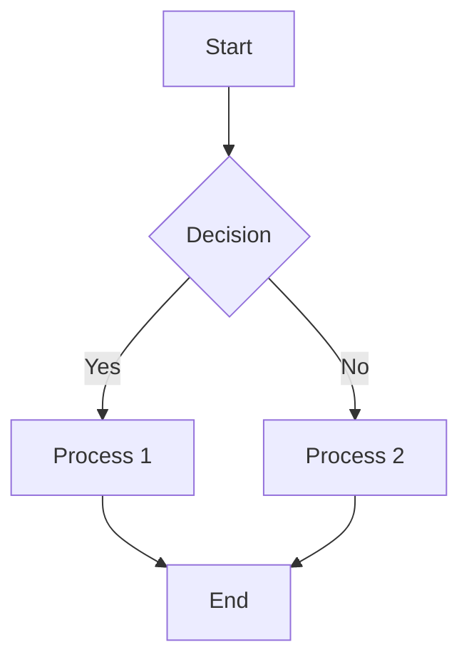
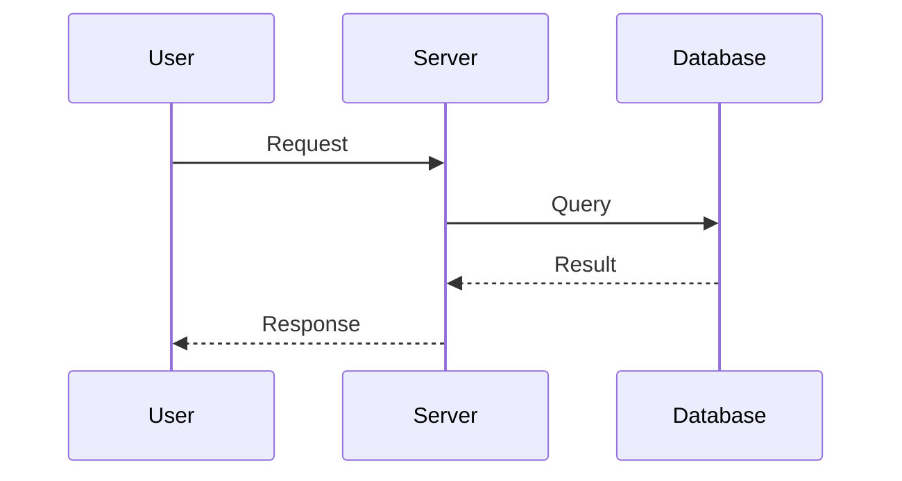

# Test Diagrams

## Flow

```mermaid
graph TD
    A[Start] --> B{Decision}
    B -->|Yes| C[Process 1]
    B -->|No| D[Process 2]
    C --> E[End]
    D --> E
```

## Sequence

```mermaid
sequenceDiagram
    participant A as User
    participant B as Server
    participant C as Database
    A->>B: Request
    B->>C: Query
    C-->>B: Result
    B-->>A: Response
```
